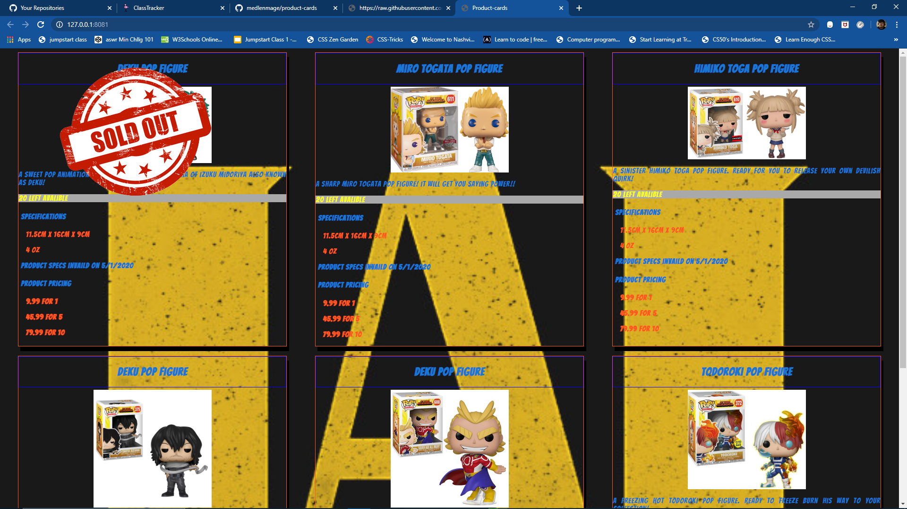

# Product Cards

## Description
This is a small exercise showcasing sample product cards using html and css

### Features
* showcases 6 cards with various pop figures as the products
* features cards evenly space and in 2 rows of 3
* one card showcases putting a sold out sticker over the product

### Screenshots


### How to run
1. clone down the repo
2. using hs command in console load server and choose from the two
3. in browser go to local host where it is being held

## Contributors
* [Joshua Medlen](https://github.com/medlenmage)

## To-Do
- [] gather product images and infomation on products that are going to be used
- [] hard code the cards into html using the images and information gathered
- [] style cards and site in which to appeal to potential customer base

## Card Code Example

```html
  <div class="card">
    <section class="sec1">
      <header class="head"><h2>Deku Pop Figure</h2></header>
      
      <p class="description">A bright and smiling All Might pop figure. Ready to save you with a smile!</p>
      <p class="availbilty">20 left avalible</p>
    </section>
    
    <section class="sec2">
      <header><h4>Specifications</h4></header>
      <p class="size">11.5cm x 16cm x 9cm</p>
      <p class="weight">4 oz</p>
      <footer class="productspec">Product specs invaild on 5/1/2020</footer>
    </section>
    
    <section class="sec3">
      <header><h4>Product Pricing</h5></header>
      <p class="quanity">9.99 for 1</p>
      <p class="quanity">45.99 for 5</p>
      <p class="quanity">79.99 for 10</p>
    </section>
  </div>
```
